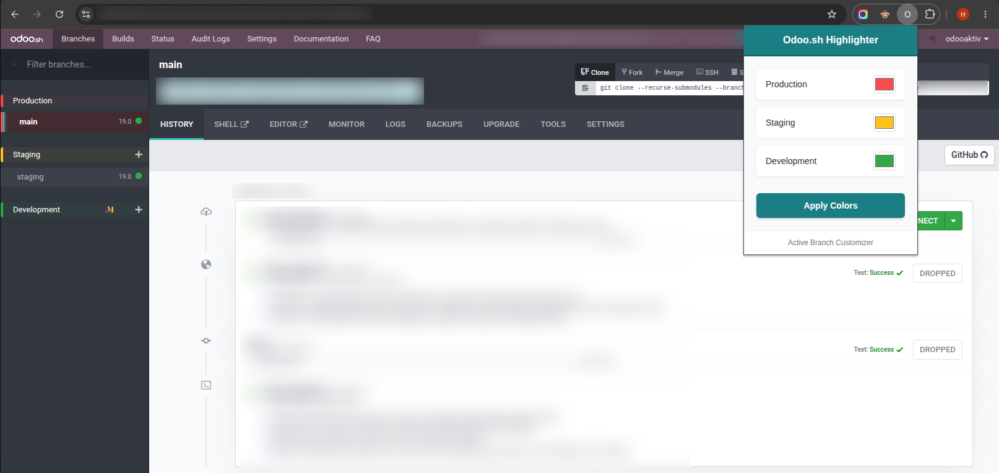

# 🎨 Odoo.sh Branch Highlighter

A lightweight Google Chrome extension built with Manifest V3 to visually distinguish **Production**, **Staging**, and **Development** branch sections on [Odoo.sh](https://www.odoo.sh) with live customizable colors.



---

## 🚀 Why Use This?

When working across multiple projects and branches in Odoo.sh, it is easy to lose track of whether you are inspecting a development build or the live production environment. 

**Odoo.sh Branch Highlighter** prevents costly mistakes by:
- Giving distinct, colored visual borders and tinted background accents to branch sections.
- Prominently highlighting the currently active branch.
- Providing a popup color picker to customize stage colors to your preference.

---

## ✨ Features

- **Custom Color Pickers:** Set custom hex colors for Production, Staging, and Development environments via the toolbar popup.
- **Live Updates:** Changes apply instantly to active tabs without requiring a page reload.
- **Dynamic Branch Detection:** Accurately detects and highlights active branches across single-page transitions (`pushState` / `popstate` and DOM mutations).
- **Clean & Non-Intrusive:** Uses subtle tinted accents (rgba) and border indicators so it seamlessly blends into the native Odoo.sh interface.
- **Lightweight & Secure:** Built on Manifest V3 with minimal permissions (`storage` only, scoped strictly to `*://*.odoo.sh/*`).

---

## 📥 Installation (Developer Mode)

Since this extension is distributed via GitHub, you can install it directly in Google Chrome:

1. **Clone or Download the Repository:**
   ```bash
   git clone https://github.com/savan-hirapara/odoosh-branch-highlighter.git
   ```
   *(Or download the repository as a ZIP archive and extract it).*

2. **Open Chrome Extensions:**
   Navigate to `chrome://extensions/` in your Chrome browser.

3. **Enable Developer Mode:**
   Toggle the **Developer mode** switch in the top-right corner.

4. **Load the Extension:**
   - Click the **Load unpacked** button in the top-left corner.
   - Select this directory (the folder containing `manifest.json`).

5. Pin the **Odoo.sh Highlighter** icon to your Chrome toolbar for quick access.

---

## 🛠️ Usage

1. Open any project on [Odoo.sh](https://www.odoo.sh).
2. Click the **Odoo.sh Highlighter** icon in your Chrome toolbar.
3. Choose your preferred colors:
   - **Production** (Default: `#ff4d4d` Red)
   - **Staging** (Default: `#ffc107` Amber)
   - **Development** (Default: `#28a745` Green)
4. Click **Apply Colors**. Your settings are saved across browser sessions via Chrome Sync storage.

---

## 📂 Project Structure

```text
├── assets/
│   └── screenshot.png     # Preview screenshot
├── icons/
│   ├── icon16.png         # 16x16 icon (favicon / tab)
│   ├── icon48.png         # 48x48 icon (extensions manager)
│   └── icon128.png        # 128x128 icon (store / high-DPI)
├── manifest.json          # Extension metadata & permissions (Manifest V3)
├── content.js             # Branch detection, DOM observer & dynamic style injection
├── style.css              # Structural CSS overrides
├── popup.html             # Color configuration popup UI
└── popup.js               # Color persistence via chrome.storage.sync
```

---

## 🔒 Permissions & Privacy

- `storage`: Used solely to save and synchronize your color preferences across your Chrome profile.
- Scoped to `*://*.odoo.sh/*`: Runs exclusively on Odoo.sh pages and does not read, collect, or transmit any sensitive project, user, or client data.

---

## 🤝 Contributing

Contributions, bug reports, and suggestions are welcome! Feel free to open an issue or submit a pull request.

---

## 📄 License

This project is licensed under the [MIT License](LICENSE).
